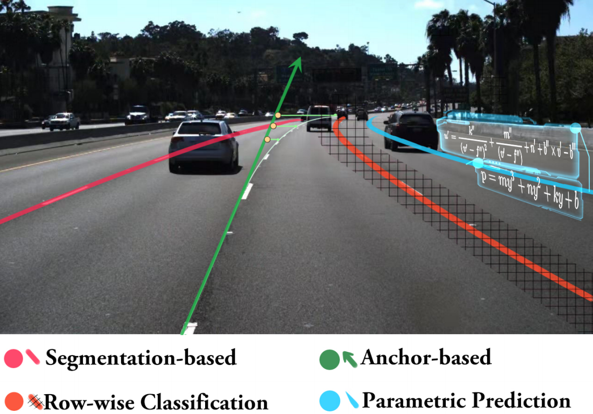
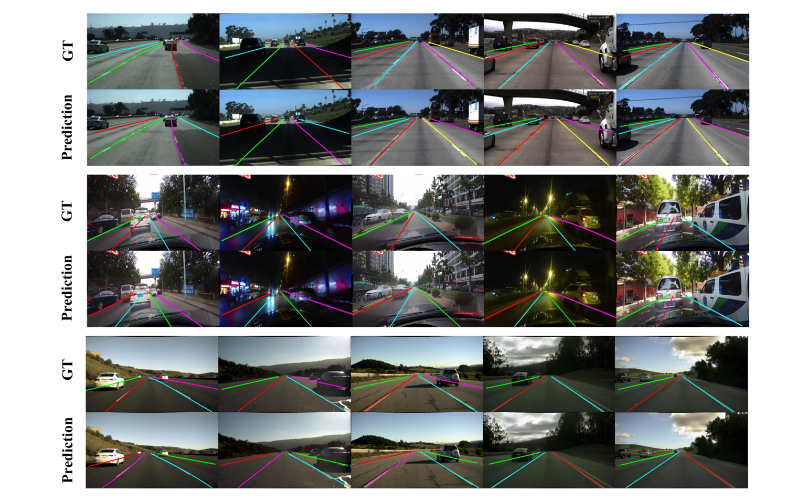
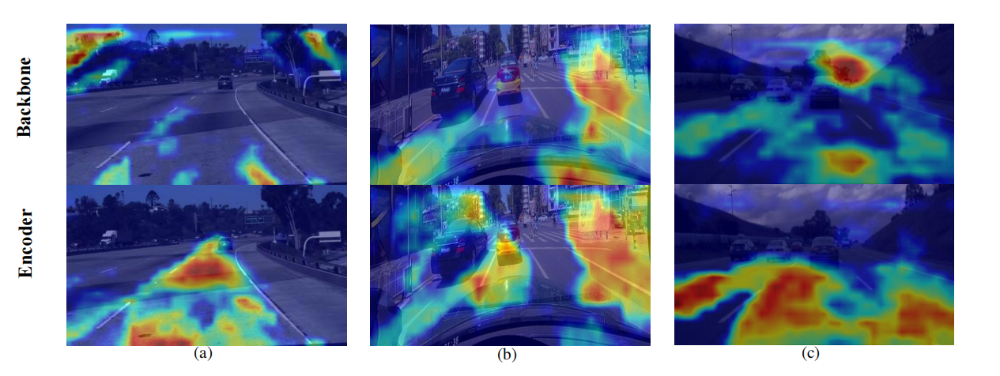
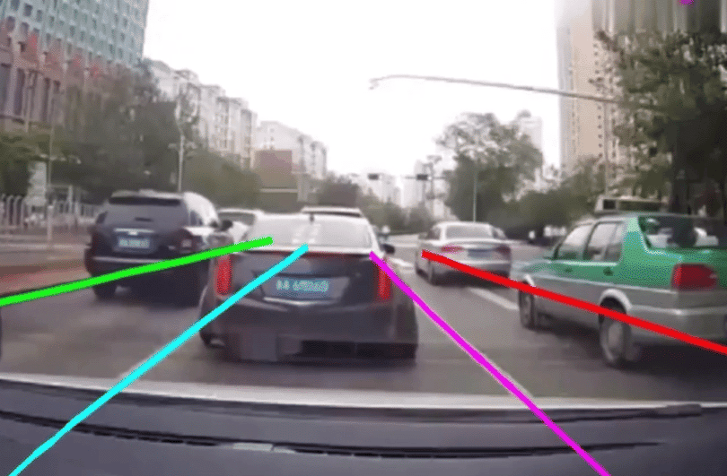

# PGA-Net: Polynomial Global Attention Network with Mean Curvature Loss for Lane Detection

- Related works
    - 

- Overview of our PGA-Net
    - 

## 1.Dataset
### CULane

Download [CULane](https://xingangpan.github.io/projects/CULane.html). Then extract them to `$CULANEROOT`. Create link to `data` directory.

```Shell
cd $LANEDET_ROOT
mkdir -p data
ln -s $CULANEROOT data/CULane
```

For CULane, you should have structure like this:
```
$CULANEROOT/driver_xx_xxframe    # data folders x6
$CULANEROOT/laneseg_label_w16    # lane segmentation labels
$CULANEROOT/list                 # data lists
```

### Tusimple
Download [Tusimple](https://github.com/TuSimple/tusimple-benchmark/issues/3). Then extract them to `$TUSIMPLEROOT`. Create link to `data` directory.

```Shell
cd $LANEDET_ROOT
mkdir -p data
ln -s $TUSIMPLEROOT data/tusimple
```

For Tusimple, you should have structure like this:
```
$TUSIMPLEROOT/clips # data folders
$TUSIMPLEROOT/lable_data_xxxx.json # label json file x4
$TUSIMPLEROOT/test_tasks_0627.json # test tasks json file
$TUSIMPLEROOT/test_label.json # test label json file

```

For Tusimple, the segmentation annotation is not provided, hence we need to generate segmentation from the json annotation. 

```Shell
python tools/generate_seg_tusimple.py --root $TUSIMPLEROOT
# this will generate seg_label directory
```

### LLAMAS
Download [LLAMAS](https://unsupervised-llamas.com/llamas/)
[Official Paper](https://openaccess.thecvf.com/content_ICCVW_2019/papers/CVRSUAD/Behrendt_Unsupervised_Labeled_Lane_Markers_Using_Maps_ICCVW_2019_paper.pdf) 

## 2.Demo
- ### Result on three benchmark
    - Our method achieves **state-of-the-art** performance on two popular benchmarks (TuSimple and LLAMAS) and a most challenging benchmark (CULane) with faster speed (**>140fps**) and lightweight model size (**<3M**).
    - Visualization results on TuSimple (the first row), CULane (the middle row), and LLAMAS (the last row) datasets. Different lane instances are represented by different colors.
        - 

- ### Grad-CAM with our PGA-Net
    - Grad-CAM visualization on the last layer of the ResNet backbone and the transformer encoder. (a) Visualization on Tusimple. (b) Visualization on CULane. (c) Visualization on LLAMAS. The encoder aggregates a lot of contextual information and constrains the attention features to the lane road even the lane with occluded.
        - 

- ### PGANet infers lane lines from **real vehicle cameras**
The PGA-Net used in the following inference is only trained on the CULane dataset.

- Complex road conditions
    - 

- Simple road conditions
    - 

## 3.Codes
Codes will be released after paper acceptance.
